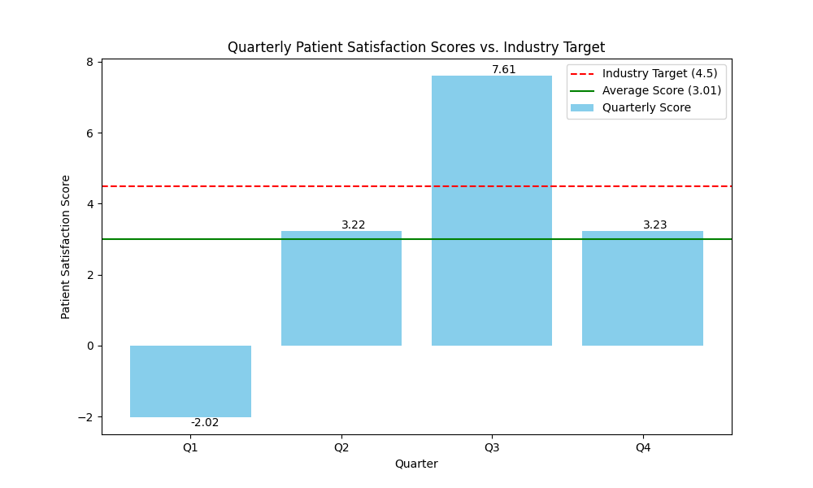

# Healthcare Performance Analysis: A Data-Driven Story

## Business Case: Enhancing Patient Satisfaction

Our healthcare company is currently facing a critical challenge: a decline in patient satisfaction scores. With a current average of 3.01, we are falling short of the industry benchmark of 4.5. This data story provides a comprehensive analysis of our quarterly performance, identifies key areas for improvement, and offers actionable recommendations to elevate our patient experience.

## Quarterly Performance Analysis

The patient satisfaction data for 2024 reveals a fluctuating trend across the four quarters. While there was a significant peak in Q3, the overall average remains below the target.

### 2024 Quarterly Patient Satisfaction Scores:
- **Q1:** -2.02
- **Q2:** 3.22
- **Q3:** 7.61
- **Q4:** 3.23
- **Average:** 3.01

### Visualization

The following chart visualizes our quarterly performance against the industry target, highlighting the gap we need to bridge.

## Key Findings

1.  **Inconsistent Performance:** The satisfaction scores show significant volatility, with a notable outlier in Q1. This suggests that our service quality is not consistent.
2.  **Below-Average Score:** Our average score of 3.01 is significantly lower than the industry target of 4.5, indicating a competitive disadvantage.
3.  **Potential for Improvement:** The peak in Q3 demonstrates that we are capable of achieving high satisfaction scores, but we need to understand the drivers behind this success and replicate them consistently.

## Business Implications

- **Reputation and Patient Trust:** Consistently low satisfaction scores can damage our reputation and erode patient trust, leading to a decline in patient loyalty.
- **Financial Impact:** Poor patient experience can result in negative online reviews and reduced patient referrals, ultimately impacting our revenue.
- **Competitive Disadvantage:** In a competitive healthcare market, failing to meet industry standards can lead to losing patients to competitors with better service quality.

## Recommendations to Reach the Target of 4.5

To achieve our target of 4.5, we must focus on improving two critical areas: **service quality and wait times.**

### 1. Enhance Service Quality

- **Implement a Continuous Training Program:** Develop a mandatory monthly training program for all patient-facing staff, focusing on communication skills, empathy, and conflict resolution.
- **Standardize Service Protocols:** Create and enforce standardized protocols for all common patient interactions to ensure a consistent and high-quality experience.
- **Gather Real-Time Feedback:** Implement a real-time feedback system (e.g., SMS surveys after appointments) to quickly identify and address service gaps.

### 2. Reduce Wait Times

- **Optimize Appointment Scheduling:** Leverage a data-driven approach to analyze patient flow and optimize appointment scheduling to minimize patient wait times.
- **Improve Clinic Workflow:** Redesign clinic workflows to streamline patient check-in, triage, and check-out processes.
- **Introduce Telehealth Options:** Expand our telehealth services to provide a convenient alternative for routine consultations, reducing the burden on our physical clinics.

By implementing these targeted recommendations, we can create a more consistent, positive patient experience, and ultimately achieve our goal of a 4.5 patient satisfaction score.

---

*This analysis was prepared by [Your Name/Team]. For inquiries, please contact: 24f1001771@ds.study.iitm.ac.in*
